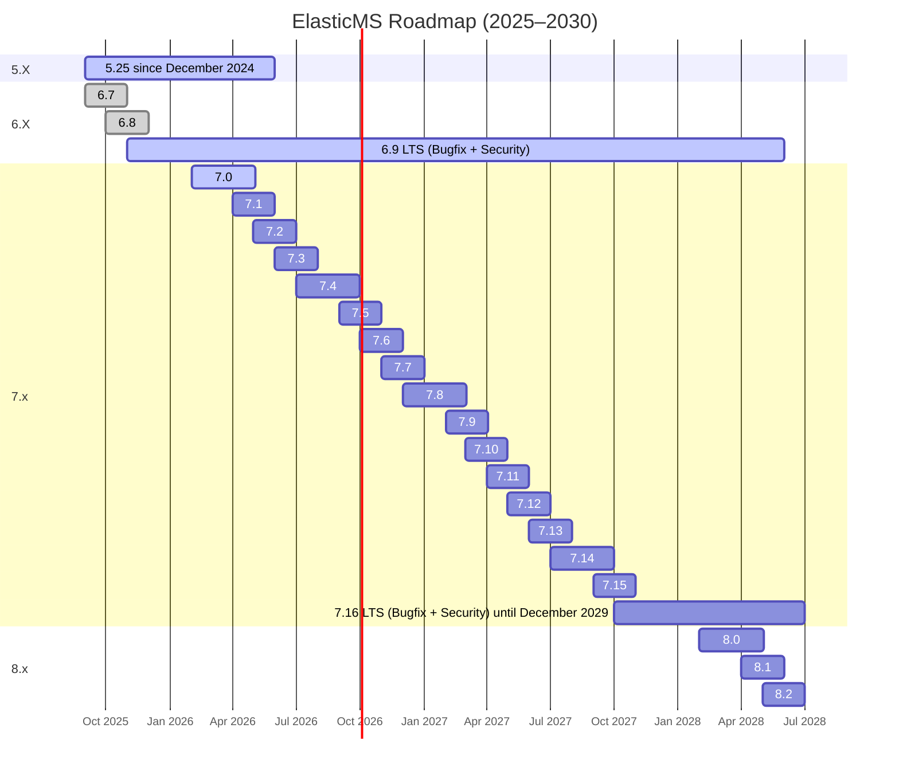

# ElasticMS Release & Roadmap Policy

ElasticMS follows a **predictable, time-based release strategy**, inspired by mature ecosystems such
as Symfony.  
The objective is to balance **long-term stability**, **controlled evolution**, and **operational
safety**.

---

## Release Types

### Patch releases (`x.y.z`)

- Bug fixes only
- No functional changes
- No backward incompatibility
- Released as needed (typically weekly)
- Always safe to apply

### Minor releases (`x.y`)

- New features and technical improvements
- Backward compatible
- Short support window (≈ 2 months)
- Used to progressively introduce changes and deprecations

### Major releases (`x.0`)

- Stack upgrades and cleanup of deprecated features
- Possible breaking changes
- Introduced only when required by the roadmap
- Migration effort expected

---

## Long-Term Support (LTS)

LTS versions are the **recommended choice for production environments**.

- Extended support duration
- Bug fixes and security updates only
- No new features
- Reduced operational risk

Current and planned LTS versions:

- **ElasticMS 5.25 LTS** — supported until **June 2026**
- **ElasticMS 6.9 LTS** — supported until **December 2028**

---

## Minor Release Cycle (7.x)

- Regular minor releases
- Typical support duration: **~2 months**
- Used for:
    - functional evolution
    - technical improvements
    - progressive deprecations
- Minor versions act as **stepping stones toward the next LTS**

---

## Major Versions

Major versions mark **important technical transitions**:

- framework upgrades
- dependency cleanup
- removal of deprecated APIs
- alignment with upstream ecosystems (Symfony, PHP, Elasticsearch / OpenSearch)

Example:

- **ElasticMS 8.x** starts in **2028**, following the stabilization of the 7.x series and its LTS.

---

## Roadmap Overview

Remarks:

- The real start date of 5.25 is December 2024
- The real end date of 7.20 is December 2029

## Key Principles

- Prefer LTS versions for production systems
- Minor versions are short-lived by design
- Major upgrades are planned and documented
- The roadmap is aligned with upstream technologies
- Dates may evolve, but the release structure remains stable
